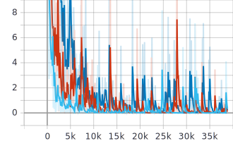
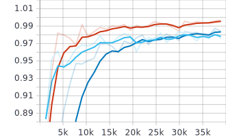

# Hiragana-Recognition
The project is aimed to the Neural Network course project, which compares the state-of-the-art image classification networks. 

# Usage
1. Install all libraries required in "requirements.txt"
2. Change the training configuration in "config.py"
3. Use the following command to try the training process.

```shell script
python inference.py --train --vgg
```

* To continue training process, run the following command:
```shell script
python inference.py --train --vgg --load /path/to/checkpoint/file.tar
```

* Available models:
    * --vgg: Use VGG 19 with Batch Normalization. Minimum input size 224x224x3
    * --inception: Use Inception V3 Net. Minimum input size 299x299x3, batch size must > 1.
    * --simple: Use customized CNN.
    
* Available modes:
    * --train: Start training process.
    * --test: Start testing process.
    
* Available inputs:
    * --dataset: Path to the dataset.
    * --load: path to the saved 'tar' checkpoint file.

## Dependencies
Please refer to the "requirements.txt" file in the project folder.
1. torch~=1.4.0
2. numpy~=1.18.2
3. tqdm~=4.45.0
4. torchvision~=0.5.0
5. scikit-learn~=0.22.2.post1
6. matplotlib~=3.2.1
7. opencv-python~=4.2.0

## Results
| \ | VGG 19 with BN | Inception v3 |
| :--- | :---: | :---: |
| Input Size | 224x224x3 | 299x299x3
| Batch Size | 8 | 8
| Learning Rate | 1e-3 | 1e-3
| Train/Test Split | 85%/15% | 85%/15%
| Epochs | 30 | 30
| Parameters | 126,001,031 | 24,543,342
| Validation Loss | 0.7290 | 0.2385
| Validation Accuracy | 98.74% | 99.5%
| Inference Time| 0.0294s/it | 0.0189s/it |

 `Inception v3`
 `VGG 19 with BN`

##### Training Accuracy
 <!-- .element height="25%" width="25%" -->

##### Training Loss
 <!-- .element height="25%" width="25%" -->

##### Validation Accuracy
 <!-- .element height="25%" width="25%" -->

##### Validation Loss
 <!-- .element height="25%" width="25%" -->
